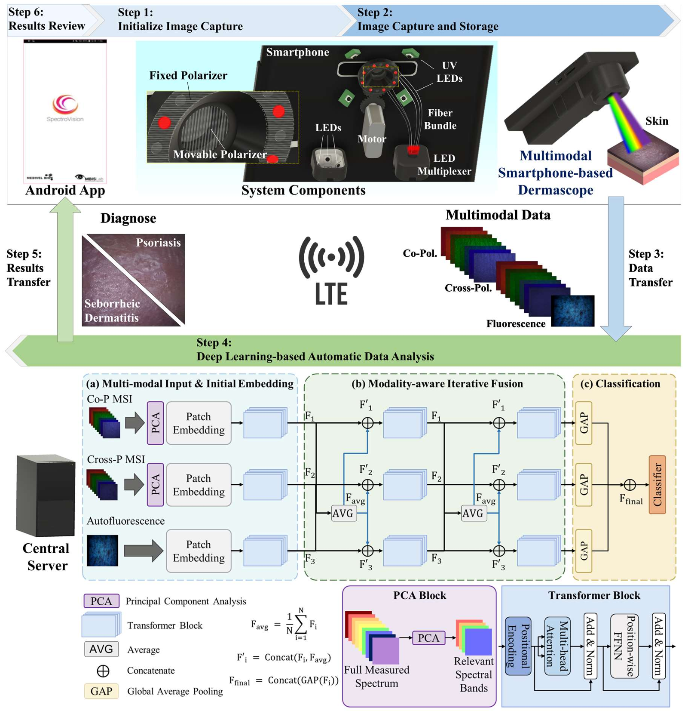

# mSpecFusion-Net

Official repository for the MICCAI 2026 paper:

> **mSpecFusion-Net: Intelligent Multimodal Smartphone Imaging for Mobile Differential Diagnosis of Psoriasis and Dermatitis and Deep Learning**
>
> Sewoong Kim*, Seong-Hyun Kim*, Thiago Coutinho Cavalcanti*, Jonghun Lee, Moon Hwan Lee, Donghun Lee†, Jae Youn Hwang†
>
> *Equal contribution. †Corresponding authors.
>
> *Accepted at the 29th International Conference on Medical Image Computing and Computer Assisted Intervention (MICCAI 2026), Strasbourg, France.*

---

## Overview

mSpecFusion-Net is a modality-aware iterative-fusion Transformer for smartphone-based differential diagnosis of psoriasis and seborrheic dermatitis. The model integrates three complementary optical contrasts acquired with a portable smartphone-based multimodal dermascope:

- **Co-polarized multispectral imaging (Co-P MSI)** — 8-band reflectance (435–640 nm)
- **Cross-polarized multispectral imaging (Cross-P MSI)** — 8-band reflectance with surface specular suppression
- **Ultraviolet-excited autofluorescence (UV-AF)** — biochemical-sensitive contrast

<p align="center">
  
</p>

A PCA-based discrete band selection step compresses each multispectral stack to its most informative bands prior to fusion, and a parallel-branch Transformer with iterative cross-modal aggregation progressively refines complementary evidence across modalities into a unified diagnostic representation.

Under patient-wise 5-fold cross-validation on a clinical cohort of 32 patients (18 psoriasis, 14 seborrheic dermatitis), mSpecFusion-Net achieves:

| Metric | Value (mean ± SD) |
|---|---|
| F1 | 0.9057 ± 0.0612 |
| Accuracy | 0.9068 ± 0.0576 |
| ROC-AUC (micro) | 0.9461 ± 0.0540 |
| PRC-AUC (micro) | 0.9358 ± 0.0666 |

with 4.18 M trainable parameters (16.0 MB, fp32) and a measured GPU inference latency of 17.3 ms/image at batch size 1.

---

## Release Scope

This repository releases the **final mSpecFusion-Net model** — architecture, training, evaluation, and preprocessing code. The fusion-strategy baselines (early/middle/late fusion) and the generic backbone comparisons reported in Tables 3 and 5 of the paper are not included; the backbone baselines use publicly available reference implementations (ResNet, EfficientNet, ConvNeXt, Swin Transformer, ViT) adapted to our multimodal input.

For inquiries, early access requests, or collaboration, please contact the corresponding author at **jyhwang@dgist.ac.kr**.

---

## Getting Started

### Environment

Developed with Python 3.9.19, TensorFlow 2.13, CUDA 11.8 / cuDNN 8 on NVIDIA RTX A5000 GPUs.

```bash
conda create -n mspecfusion python=3.9
conda activate mspecfusion
conda install -c conda-forge cudatoolkit=11.8 cudnn=8
pip install -r requirements.txt
```

> `tensorflow` and `tensorflow-addons` are pinned. `tensorflow-addons` is archived and supports TensorFlow <= 2.13 only; changing either version breaks the `F1Score` and `AdamW` imports.

### Repository structure

```
run_cv.py               # launcher: patient-wise 5-fold cross-validation
cus_ct5_train_loss.py   # training and evaluation
band_selection.py       # PCA-based spectral band ranking
result.py               # aggregates per-run logs into summary tables
models/custom_ct5.py    # mSpecFusion-Net architecture
preprocess/             # calibration, lesion cropping, patch extraction
utils/                  # fold split, multimodal data loader, I/O helpers
```

### Data layout

The clinical dataset used in the paper cannot be released (see Ethics & Data). To run the code, prepare your own data in the layout below.

Each sample is a single multi-channel TIFF holding all modalities stacked along the channel axis:

| Channel index | Content |
|---|---|
| 0–2 | Co-polarized RGB |
| 3–10 | Co-P MSI, 8 bands (435, 470, 490, 505, 525, 570, 610, 640 nm) |
| 11 | UV-excited autofluorescence |
| 12–14 | Cross-polarized RGB |
| 15–22 | Cross-P MSI, 8 bands |

```
data/
├── 20230525/               # <dataset-name>/ : one .tif per patch
│   └── <patient_id>.tif
└── labels_20230525.csv     # columns: patient_id, fold, <label columns>
```

`fold` assigns each patient to one of 10 disjoint groups. For each of the 5 folds the split is **7 groups train / 1 validation / 2 test**, so every patient appears in exactly one test set and no patient crosses the split boundary. Patch size is 128 x 128 by default.

Preprocessing scripts in `preprocess/` cover white-reference calibration, lesion cropping, and non-overlapping patch extraction. Adapt the paths inside them to your own directory structure.

### PCA band selection

`band_selection.py` ranks the 8 bands of each polarization stream by cumulative absolute PCA loading and returns the top-*K* indices. Because the selection is a discrete index choice rather than a learned projection, it is computed once on the calibrated dataset and fixed across all folds.

```bash
python band_selection.py
```

The resulting indices are defined in `models/custom_ct5.py :: splitData()` as the `sp_<K>` / `psp_<K>` variants. The paper uses **K = 4**.

### Training

Default arguments reproduce the configuration reported in the paper (Co-P MSI + Cross-P MSI + UV-AF, PCA top-4 bands, iterative fusion, batch 16, 150 epochs, Adam with exponential decay from 1e-4):

```bash
python run_cv.py --gpu 0
```

Modality ablations are run by changing one argument. `sp` = Co-P MSI, `psp` = Cross-P MSI, `uv` = UV-AF; the `_4` suffix applies PCA top-4 band selection.

```bash
python run_cv.py --gpu 0 --name_type_dataset sp_4+psp_4   # without UV-AF
python run_cv.py --gpu 0 --name_type_dataset sp+psp+uv    # without PCA
python run_cv.py --gpu 0 --name_type_dataset rgb          # RGB only
```

Training uses binary focal cross-entropy with label smoothing 0.2, early stopping on validation loss (patience 50), and checkpointing on a 5-epoch smoothed validation F1.

### Evaluation

Each run appends its metrics to a CSV in the result directory. To aggregate across folds and export a summary spreadsheet:

```bash
python result.py
```

Reported metrics are patch-level and micro-averaged over the five folds.

---

## Citation

If you find this work useful, please consider citing:

```bibtex
@inproceedings{kim2026mspecfusion,
  title     = {mSpecFusion-Net: Intelligent Multimodal Smartphone Imaging
               for Mobile Differential Diagnosis of Psoriasis and
               Dermatitis and Deep Learning},
  author    = {Kim, Sewoong and  Kim, Seong-Hyun and Cavalcanti, Thiago Coutinho and Lee, Jonghun and
               Lee, Moon Hwan and Lee, Donghun and Hwang, Jae Youn},
  booktitle = {Medical Image Computing and Computer Assisted
               Intervention -- MICCAI 2026},
  year      = {2026},
  publisher = {Springer Nature Switzerland}
}
```

This site will be updated after official publication of the paper, with the official LNCS volume and page numbers will be assigned.

---

## Ethics & Data

The clinical study was approved by the Institutional Review Board of Seoul National University Hospital (IRB No. 1908-161-1059), and informed consent was obtained from all participants. **Clinical patient data will not be released** to protect participant privacy, in accordance with the approved protocol. The code in this repository can be applied to comparable multimodal datasets prepared in the layout described above.

---

## License

This code is provided for academic research and reproducibility purposes only.
For commercial use or redistribution, please contact the corresponding author.

---

## Contact

- **Jae Youn Hwang** (corresponding author) — `jyhwang@dgist.ac.kr`
- **Donghun Lee** (corresponding author, clinical) — `ivymed27@snu.ac.kr`
- **Seong-Hyun Kim** — `rlatjdgus224@dgist.ac.kr`

Affiliations: Department of Electrical Engineering and Computer Science / Department of Artificial Intelligence / Department of Biomedical Science and Engineering, Daegu Gyeongbuk Institute of Science and Technology (DGIST), Daegu, Republic of Korea; RNSLab Co., Ltd., Incheon, Republic of Korea; Max Planck Institute for Medical Research, Heidelberg, Germany; Department of Dermatology, Seoul National University Hospital, Seoul, Republic of Korea.
